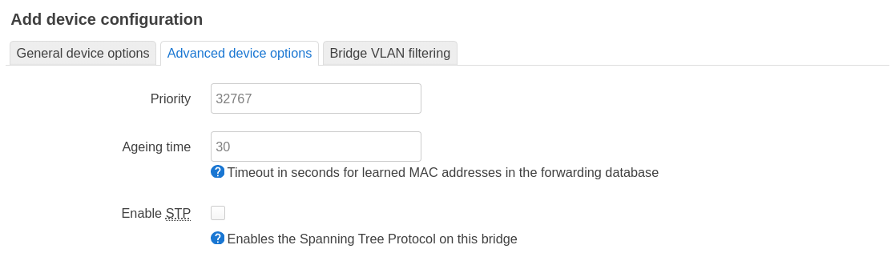
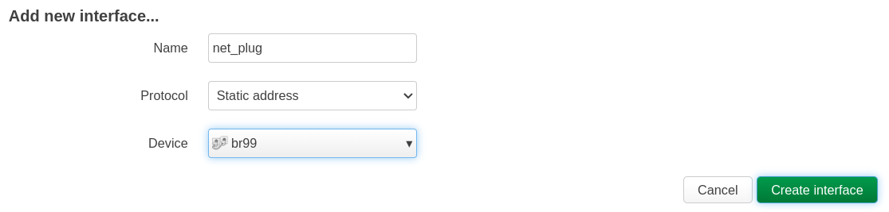

# Configure OpenWRT

- [Configure OpenWRT](#configure-openwrt)
  - [Summary](#summary)
  - [Our infrastructure and our goal](#our-infrastructure-and-our-goal)
  - [Install OpenWRT on x86 64](#install-openwrt-on-x86-64)
  - [Sub-net "stage". Add "left" bridge linked to VLAN ID 102 (stage sub-net) on port eth7](#sub-net-stage-add-left-bridge-linked-to-vlan-id-102-stage-sub-net-on-port-eth7)
  - [Sub-net "productive". Add "middle 103" bridge linked to VLAN ID 103 (productive sub-net) on ports eth6 and eth7.](#sub-net-productive-add-middle-103-bridge-linked-to-vlan-id-103-productive-sub-net-on-ports-eth6-and-eth7)
  - [Sub-net "stage". Add interface "stg" with static DHCP protocol.](#sub-net-stage-add-interface-stg-with-static-dhcp-protocol)
  - [Sub-net "productive". Add interface "prod" with static DHCP protocol.](#sub-net-productive-add-interface-prod-with-static-dhcp-protocol)
  - [Apply changes](#apply-changes)
  - [Configure firewall zones and rules for "stg" and "prod" interfaces](#configure-firewall-zones-and-rules-for-stg-and-prod-interfaces)
  - [Sub-net "development". Add "right" bridge linked to VLAN ID 101 (development sub-net) on port eth6](#sub-net-development-add-right-bridge-linked-to-vlan-id-101-development-sub-net-on-port-eth6)
  - [Sub-net "IoT". Add "middle 104" bridge linked to VLAN ID 103 (for IoT sub-net) on ports eth6 and eth7](#sub-net-iot-add-middle-104-bridge-linked-to-vlan-id-103-for-iot-sub-net-on-ports-eth6-and-eth7)
  - [Unlink ports eth6 and eth7 from "br-lan" bridge](#unlink-ports-eth6-and-eth7-from-br-lan-bridge)
  - [Add "net plug" sub-net](#add-net-plug-sub-net)
  - [Final status](#final-status)

## Summary

Below is step-by-step guidance how to configure OpenWRT v.23.05.3 installed on x86 64 PC to manage multiple VLANs on 2 ethernet ports.

You can skip below guidance and go directly to [final OpenWRT configuration status](./openwrt_configuration_final.md) or to [list of recommended tests for our network setup](./openwrt_configuration_testing.md).

## Our infrastructure and our goal

Imagine, that you and me, we are establishing startup &#x1F680; / small business &#x1F3A9;. We are going to provide customers with web service (on-line shop, web portal, ...) &#x1F3AF;. 

For our web service we are going to configure CI/CD pipeline. For this reason we need 3 isolated environments: Development, Staging, Productive. Each environment needs dedicated network segment (sub-net). As usually, for our teams (developers, testers, support, IT Sec&Ops and administrators) we need provide connections to our corporate network (`LAN`) &#x1F4BB;, printers &#x1F5A8;, Internet &#x1F30F; and these 3 environments.

We are limited in budget &#x1FA99; (as usual &#x1F609;). Our initial infrastructure includes:

- PC x86 64 with 5 ethernet ports, few GiB hard disk, 16 GiB RAM and power enough CPU. This is our OpenWRT router.
- 2x manageable switches for server infrastructure
- 2x unmanageable switches for user network segment (`LAN`)

Later we will add servers (for provisioning virtual machines), NAS storages, ...

Network physical connections:
- all servers are connected to manageable switches (1 and 2), that linked to OpenWRT router ports `eth6` and `eth7`.
- our team laptops and printers are connected to unmanageable switches (3 and 4), that linked to OpenWRT router ports `eth4` and `eth5`.

We want to get maximum output from our limited hardware resources, by utilizing open-source tools and leveraging know-how capital from open-source community.

We want our network infrastructure to look similar like on schema below:

We want to configure communication between sub-nets, allowing requests from sub-net A to sub-net B but not in opposite direction:

We are going to reach our goal by configuring OpenWRT router as shown below diagram (here you will find [same ideas in textual form](./openwrt_configuration_target.md)):

Don't panic, this project is much easier than you think about it.

## Install OpenWRT on x86 64

Follow below instructions how to install OpenWRT on x86 64 hardware:

- [OpenWrt docs. OpenWrt on x86 hardware (PC / VM / server)](https://openwrt.org/docs/guide-user/installation/openwrt_x86)
- [OpenWRT firmware selector. Download image for Generic x86/64: COMBINED-EFI (EXT4)](https://firmware-selector.openwrt.org/?version=23.05.3&target=x86%2F64&id=generic) or [use this source directly](https://downloads.openwrt.org/releases/23.05.3/targets/x86/64/)

After OpenWRT is installed and you logged into graphical interface, you can continue with below chapters.

Here you can find [initial configuration for OpenWRT v23.05 on PC x86 64](./openwrt_configuration_initial.md)

## Sub-net "stage". Add "left" bridge linked to VLAN ID 102 (stage sub-net) on port eth7

We numerate steps to show them on our diagram (you will find it below, right after step 15).

Step 1. Add bridge device. Click on "Add device configuration..":

- **Device type** (link kind): Bridge device
- **Device name** (link ifname): `brl102`. This is "left" bridge for VLAN ID 102 only ("stage" sub-net)
- **Enable IPv6**: `disabled`
- **Bridge ports**: in `--custom--` type `eth7.102` (step 2)

Hit Enter key:

Keep default settings in "Advanced device options":

Keep default settings in "Bridge VLAN filtering":

Click "Save".

## Sub-net "productive". Add "middle 103" bridge linked to VLAN ID 103 (productive sub-net) on ports eth6 and eth7. 

Step 3. Add bridge device. Click on "Add device configuration..":

- **Device type** (link kind): Bridge device
- **Device name** (link ifname): `brm103`. This is "middle" bridge for VLAN ID 103 only ("productive" sub-net)
- **Enable IPv6**: `disabled`
- **Bridge ports**: 
  - in `--custom--` type `eth6.103` and hit "Enter" key (step 4)
  - in `--custom--` type `eth7.103` and hit "Enter" key (step 5)

Both new custom interfaces are selected:

Keep default settings in "Advanced device options":

Keep default settings in "Bridge VLAN filtering":

Click "Save".

Now we have devices as shown below. Note that so far we don't see eth6.103 and eth7.103 VLANs:

## Sub-net "stage". Add interface "stg" with static DHCP protocol.

Click "Add new interface.. ":

Set:

- **Name**: `stg`
- **Protocol**: `Static address`
- **Device**: `brl102` (step 7)

Step 6. Click "Create interface":

Step 8. Set DHCP server:

- **IPv4 address**: `192.168.102.1`
- **IPv4 netmask**: `255.255.255.0`

Keep default settings in "Advanced Settings":

Keep default settings in "Firewall Settings" (we will configure it later):

In "DHCP Server" click on "Set up DHCP Server":

Keep default settings here:

Finally click "Save"

## Sub-net "productive". Add interface "prod" with static DHCP protocol.

Step 9. Click "Add new interface.. ":

Set:

- **Name**: `prod`
- **Protocol**: `Static address`
- **Device**: `brm103` (step 10)

.. and click on "Create interface":

Step 11. Set DHCP server:

- **IPv4 address**: `192.168.103.1`
- **IPv4 netmask**: `255.255.255.0`

Keep default settings in "Advanced Settings":

Keep default settings in "Firewall Settings" (we will configure it later):

In "DHCP Server" click on "Set up DHCP Server":

Keep default settings here:

Finally click "Save"

## Apply changes

Click "Save & Apply":

"stg" and "prod" interfaces have gray header because they are not included into firewall zones yet:

On "Devices" tab: MAC addresses are assigned to all devices, including VLANs:

## Configure firewall zones and rules for "stg" and "prod" interfaces

Network -> Firewall:

Click "Add":

Step 12. Set:

- **Name**: `fw_stg`
- **Input** (from firewall zone to OpenWRT host): `reject` any packet (until accepted by any firewall rule).
- **Output** (from OpenWRT host to firewall zone): `accept` any packet
- **Forward** (redirect between interfaces covered by this firewall zone): `reject` any packet (until ...)
- **Covered networks**: `stg`
- **Allow forward to destination zones**: `wan & wan6` , because we want to allow hosts from `stg` sub-net to access Internet
- **Allow forward from source zones**: `lan`, because we want hosts from `lan` sub-net to access hosts in `stg` sub-net.

Hit "Save":

Do nearly the same for "prod" sub-net:

Step 13. Set:

- **Name**: `fw_prod`
- **Input** (from firewall zone to OpenWRT host): `reject` any packet (until accepted by any firewall rule).
- **Output** (from OpenWRT host to firewall zone): `accept` any packet
- **Forward** (redirect between interfaces covered by this firewall zone): `reject` any packet (until ...)
- **Covered networks**: `prod`
- **Allow forward to destination zones**: `wan & wan6` , because we want to allow hosts from `prod` sub-net to access Internet
- **Allow forward from  source zones**: none. We don't want hosts from `lan` sub-net to access hosts in `prod` sub-net. Instead, they have to access them via Internet.

Hit "Save":

For `stg` and `prod` sub-nets, when we set `Input` option to default policy `reject`, this means that all hosts from those sub-nets (`stg`, `prod`) are not able to query OpenWRT router 1) to obtain own IP address and 2) to translate host names into IP addresses.  Default policy `input`=`reject` in firewall zones "fw_stg" and "fw_prod" means:  any requests addressed to OpenWRT host ("input" into OpenWRT), including requests to DHCP service and DNS service are dropped by firewall. 

For devices connected to `stg` and `prod` sub-nets, to allow them obtain IP address and resolve host names into IP address, we need to add firewall exceptions (rules).

Click on "Add": 

Step 14. Add rule: allow packets from `fw_stg` zone go to `device` (`device` = is our OpenWRT host), particularly to ports 53 ([DNS TCP&UDP](https://en.wikipedia.org/wiki/Domain_Name_System#DNS_over_UDP/TCP/53_(Do53))), 67 and 68 ([DHCP UDP](https://en.wikipedia.org/wiki/Dynamic_Host_Configuration_Protocol#Operation)):

- **Name**: `stage dhcp and dns`
- **Protocol**: `TCP UPD`
- **Source zone**: `fw_stg`
- **Destination zone**: `Device (input)` , this is input into OpenWRT host
- **Destination port**: `53 67 68`
- **Action**: `accept`

Step 15. Do the same for `prod` sub-net:

Click "Save & Apply":

Go to menu Network -> Interfaces. Notice that interfaces headers have change the colors, representing their firewall zones:

Below you can see all above steps mapped to our OpenWRT router configuring diagram:

## Sub-net "development". Add "right" bridge linked to VLAN ID 101 (development sub-net) on port eth6

.. do the all same as for VLAN ID 102 on "left" bridge, with logical amendments.

- bridge:
  - **Device type** (link kind): Bridge device
  - **Device name** (link ifname): `brr101`. This is "right" bridge for VLAN ID 101 only
  - **Enable IPv6**: `disabled`
  - **Bridge ports**: in `--custom--` type `eth6.101`
  
- interface:
  - **Name**: `dev`
  - **Protocol**: `Static address`
  - **Device**: `brr101`
  - **IPv4 address**: `192.168.101.1`
  - **IPv4 netmask**: `255.255.255.0`
- firewall default policy for `dev`:
  - **Name**: `fw_dev`
  - **Input** (from firewall zone to OpenWRT host): `accept` any packet
  - **Output** (from OpenWRT host to firewall zone): `accept` any packet
  - **Forward** (redirect between interfaces covered by this firewall zone): `reject` any packet (until ...)
  - **Covered networks**: `dev`
  - **Allow forward to destination zones**: `wan & wan6` , because we want to allow hosts from `dev` sub-net to access Internet
  - **Allow forward from  source zones**: `lan`, because we want hosts from `lan` sub-net to access hosts in `dev` sub-net.
- firewall rules for `dev`:
  - none

## Sub-net "IoT". Add "middle 104" bridge linked to VLAN ID 103 (for IoT sub-net) on ports eth6 and eth7

.. do all the same as for VLAN ID 103 on "middle 103" bridge, with logical amendments.

- bridge:
  - **Device type** (link kind): Bridge device
  - **Device name** (link ifname): `brm104`. This is "middle" bridge for VLAN ID 104 only
  - **Enable IPv6**: `disabled`
  - **Bridge ports**: 
    - in `--custom--` type `eth6.104` and hit "Enter" key
    - in `--custom--` type `eth7.104` and hit "Enter" key
  
- interface:
  - **Name**: `iot`
  - **Protocol**: `Static address`
  - **Device**: `brm104`
  - **IPv4 address**: `192.168.104.1`
  - **IPv4 netmask**: `255.255.255.0`
- firewall default policy for `iot`:
  - **Name**: `fw_iot`
  - **Input** (from firewall zone to OpenWRT host): `reject` any packet (until accepted by any firewall rule).
  - **Output** (from OpenWRT host to firewall zone): `accept` any packet
  - **Forward** (redirect between interfaces covered by this firewall zone): `reject` any packet (until ...)
  - **Covered networks**: `iot`
  - **Allow forward to destination zones**: none, we don't want IoTs to access Internet.
  - **Allow forward from  source zones**: `lan`, because we want hosts from `lan` sub-net to access hosts in `iot` sub-net.
- firewall rules for `iot`:
  - **Name**: `iot dhcp and dns`
  - **Protocol**: `TCP UPD`
  - **Source zone**: `fw_iot`
  - **Destination zone**: `Device (input)` , this is input into OpenWRT host
  - **Destination port**: `53 67 68`
  - **Action**: `accept`

## Unlink ports eth6 and eth7 from "br-lan" bridge

We are going to connect one manageable switch to port `eth6` and another manageable switch to port `eth7`. Many sub-nets will be redirected to these ports (VLAN trunk), excluding `lan` sub-net. We need to exclude ports `eth6` and `eth7` from bridge `br-lan` to prevent (minimize chances for) connections from our servers (especially from productive sub-net) to LAN sub-net.

Go to Network -> Interfaces -> "Devices" tab. Click "Configure..." button on "br-lan" ribbon:

By default all ports (excluding WAN port) are linked to "br-lan" bridge:

Unselect eth6 and eth7 ports in "Bridge ports": 

.. and click "Save":

## Add "net plug" sub-net

Any new service / device that is not aware about our network segmentation, will send to OpenWRT router the network packet without VLAN ID tag (or with non-existing VLAN ID tag, aka default VLAN ID = 1). Instead of dropping such packets, we would like to accept them and examine packet sender. We are going to create dedicated sub-net isolated from all other sub-nets and Internet. 

I hope, this solution can help us later to monitor and alarm about any unknown service / devices trying to connect our OpenWRT router on ports `eth6` and `eth7`.

Add device:

- **Device type** (link kind): Bridge device
- **Device name** (link ifname): `br99`. This is bridge for sub-net 192.168.99.0/24
- **Enable IPv6**: `disabled`
- **Bridge ports**: `eth6` and `eth7`

Add interface:

- **Name**: `net_plug`
- **Protocol**: `Static address`
- **Device**: `br99`

- **IPv4 address**: `192.168.99.1`
- **IPv4 netmask**: `255.255.255.0`

Set firewall zone:

- firewall default policy for `net_plug`:
  - **Name**: `fw_netplug`
  - **Input** (from firewall zone to OpenWRT host): `reject` any packet (until accepted by any firewall rule).
  - **Output** (from OpenWRT host to firewall zone): `accept` any packet
  - **Forward** (redirect between interfaces covered by this firewall zone): `reject` any packet (until ...)
  - **Covered networks**: `net_plug`
  - **Allow forward to destination zones**: none
  - **Allow forward from  source zones**: none

- firewall rules for `net_plug`:
  - **Name**: `net plug dhcp and dns`
  - **Protocol**: `TCP UPD`
  - **Source zone**: `fw_netplug`
  - **Destination zone**: `Device (input)` , this is input into OpenWRT host
  - **Destination port**: `53 67 68`
  - **Action**: `accept`

## Final status

Below are screenshots from our OpenWRT GUI. More details you can find here: [final OpenWRT configuration](./openwrt_configuration_final.md).

Network interfaces:

Network interface devices:

Firewall zones:

Firewall zone rules:

Now it's time to [test our new network setup](./openwrt_configuration_testing.md).