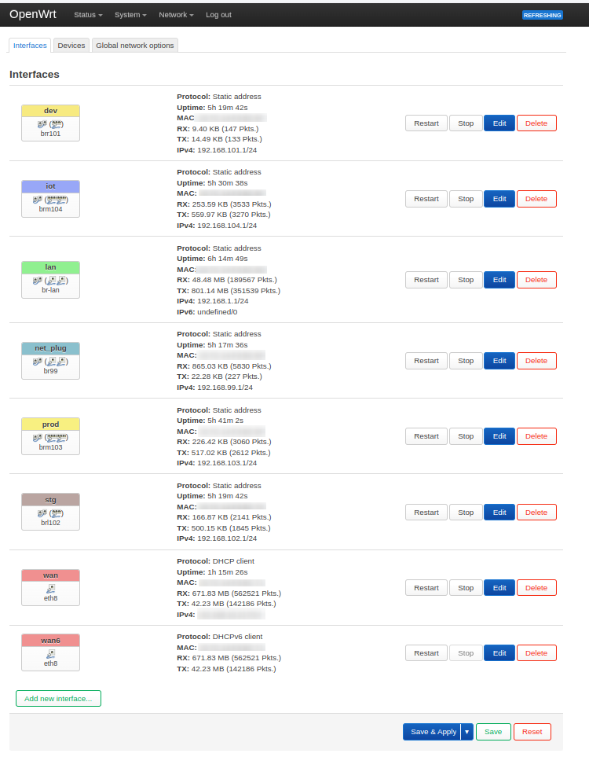
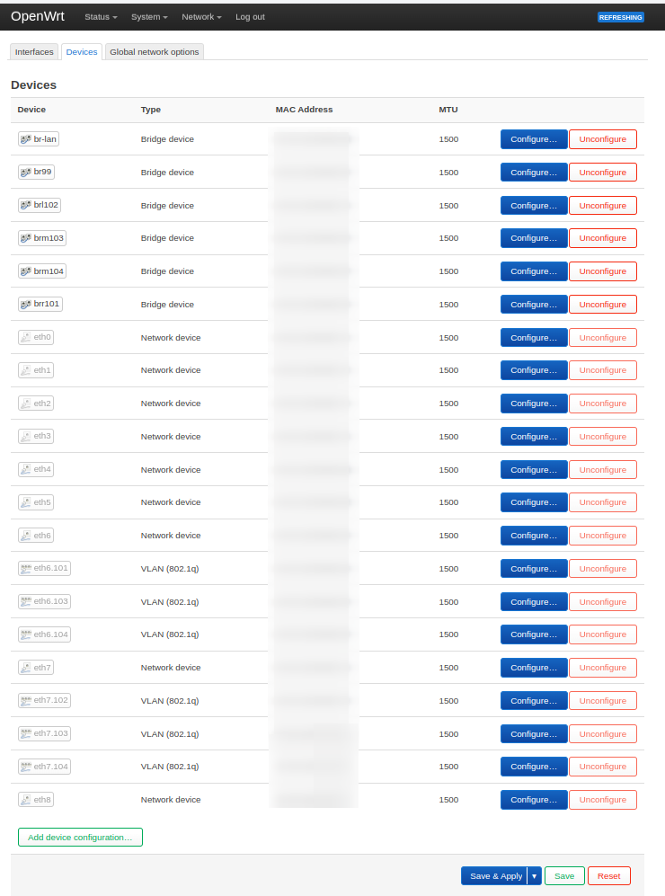
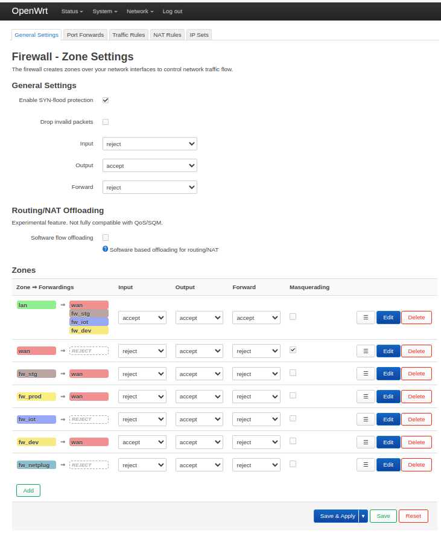
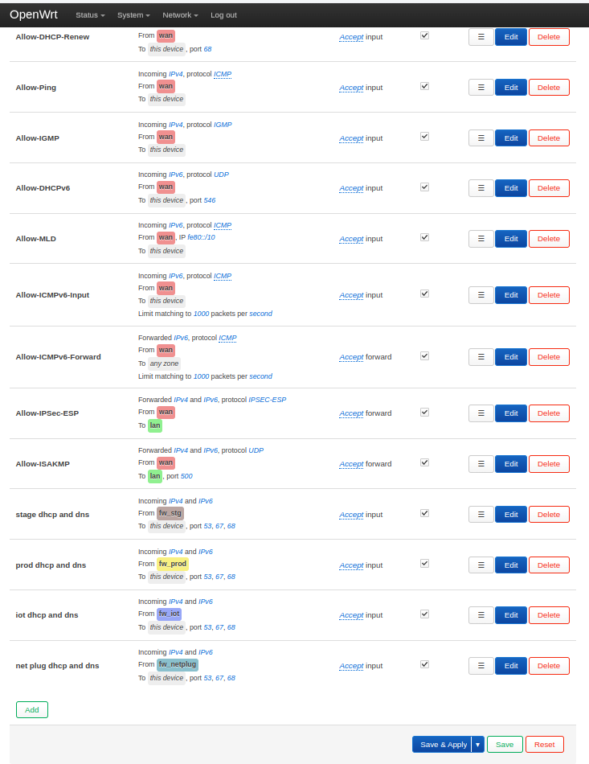

# OpenWRT v23.05 on PC x86 64. Final configuration

- [OpenWRT v23.05 on PC x86 64. Final configuration](#openwrt-v2305-on-pc-x86-64-final-configuration)
	- [final configuration. From GUI](#final-configuration-from-gui)
		- [Network -\> Interfaces](#network---interfaces)
		- [Network -\> Firewall](#network---firewall)
	- [final configuration. From CLI](#final-configuration-from-cli)

## final configuration. From GUI


### Network -> Interfaces

Network interfaces:



Network interface devices:




### Network -> Firewall

Firewall zones:



Firewall zone rules:




## final configuration. From CLI

```bash
# get hardware and OS basic info:
ubus call system board
{
	"kernel": "5.15.150",
	"hostname": "OpenWrt",
	"system": "Intel(R) Atom(TM) CPU C3758R @ 2.40GHz",
	"model": "Default string xxxxxxx",
	"board_name": "default-string-xxxxxxx",
	"rootfs_type": "ext4",
	"release": {
		"distribution": "OpenWrt",
		"version": "23.05.3",
		"revision": "r23809-234f1a2efa",
		"target": "x86/64",
		"description": "OpenWrt 23.05.3 r23809-234f1a2efa"
	}
}


# ============================
# get network config
# ============================
uci export network
package network

config interface 'loopback'
	option device 'lo'
	option proto 'static'
	option ipaddr '127.0.0.1'
	option netmask '255.0.0.0'

config globals 'globals'
	option ula_prefix 'xxxx:xxxx:xxxx::/48'

config device
	option name 'br-lan'
	option type 'bridge'
	option ipv6 '0'
	list ports 'eth4'
	list ports 'eth5'

config interface 'lan'
	option device 'br-lan'
	option proto 'static'
	option ipaddr '192.168.1.1'
	option netmask '255.255.255.0'
	option ip6assign '60'

config interface 'wan'
	option device 'eth8'
	option proto 'dhcp'

config interface 'wan6'
	option device 'eth8'
	option proto 'dhcpv6'

config device
	option type 'bridge'
	option name 'brl102'
	list ports 'eth7.102'
	option ipv6 '0'

config device
	option type 'bridge'
	option name 'brm103'
	list ports 'eth6.103'
	list ports 'eth7.103'
	option ipv6 '0'

config interface 'stg'
	option proto 'static'
	option device 'brl102'
	option ipaddr '192.168.102.1'
	option netmask '255.255.255.0'

config interface 'prod'
	option proto 'static'
	option device 'brm103'
	option ipaddr '192.168.103.1'
	option netmask '255.255.255.0'

config device
	option type 'bridge'
	option name 'brm104'
	list ports 'eth6.104'
	list ports 'eth7.104'
	option ipv6 '0'

config device
	option type 'bridge'
	option name 'brr101'
	option ipv6 '0'
	list ports 'eth6.101'

config interface 'iot'
	option proto 'static'
	option device 'brm104'
	option ipaddr '192.168.104.1'
	option netmask '255.255.255.0'

config interface 'dev'
	option proto 'static'
	option device 'brr101'
	option ipaddr '192.168.101.1'
	option netmask '255.255.255.0'

config device
	option type 'bridge'
	option name 'br99'
	list ports 'eth6'
	list ports 'eth7'
	option ipv6 '0'

config interface 'net_plug'
	option proto 'static'
	option device 'br99'
	option ipaddr '192.168.99.1'
	option netmask '255.255.255.0'


# ============================
# get DHCP config
# ============================
uci export dhcp
package dhcp

config dnsmasq
	option domainneeded '1'
	option boguspriv '1'
	option filterwin2k '0'
	option localise_queries '1'
	option rebind_protection '1'
	option rebind_localhost '1'
	option local '/lan/'
	option domain 'lan'
	option expandhosts '1'
	option nonegcache '0'
	option cachesize '1000'
	option authoritative '1'
	option readethers '1'
	option leasefile '/tmp/dhcp.leases'
	option resolvfile '/tmp/resolv.conf.d/resolv.conf.auto'
	option nonwildcard '1'
	option localservice '1'
	option ednspacket_max '1232'
	option filter_aaaa '0'
	option filter_a '0'

config dhcp 'lan'
	option interface 'lan'
	option start '100'
	option limit '150'
	option leasetime '12h'
	option dhcpv4 'server'
	option dhcpv6 'server'
	option ra 'server'
	option ra_slaac '1'
	list ra_flags 'managed-config'
	list ra_flags 'other-config'

config dhcp 'wan'
	option interface 'wan'
	option ignore '1'

config dhcp 'stg'
	option interface 'stg'
	option start '100'
	option limit '150'
	option leasetime '12h'

config dhcp 'prod'
	option interface 'prod'
	option start '100'
	option limit '150'
	option leasetime '12h'

config dhcp 'iot'
	option interface 'iot'
	option start '100'
	option limit '150'
	option leasetime '12h'

config dhcp 'dev'
	option interface 'dev'
	option start '100'
	option limit '150'
	option leasetime '12h'

config dhcp 'net_plug'
	option interface 'net_plug'
	option start '100'
	option limit '150'
	option leasetime '12h'


# ============================
# get firewall config
# ============================
uci export firewall
package firewall

config defaults
	option syn_flood '1'
	option input 'REJECT'
	option output 'ACCEPT'
	option forward 'REJECT'

config zone
	option name 'lan'
	list network 'lan'
	option input 'ACCEPT'
	option output 'ACCEPT'
	option forward 'ACCEPT'

config zone
	option name 'wan'
	list network 'wan'
	list network 'wan6'
	option input 'REJECT'
	option output 'ACCEPT'
	option forward 'REJECT'
	option masq '1'
	option mtu_fix '1'

config forwarding
	option src 'lan'
	option dest 'wan'

config rule
	option name 'Allow-DHCP-Renew'
	option src 'wan'
	option proto 'udp'
	option dest_port '68'
	option target 'ACCEPT'
	option family 'ipv4'

config rule
	option name 'Allow-Ping'
	option src 'wan'
	option proto 'icmp'
	option icmp_type 'echo-request'
	option family 'ipv4'
	option target 'ACCEPT'

config rule
	option name 'Allow-IGMP'
	option src 'wan'
	option proto 'igmp'
	option family 'ipv4'
	option target 'ACCEPT'

config rule
	option name 'Allow-DHCPv6'
	option src 'wan'
	option proto 'udp'
	option dest_port '546'
	option family 'ipv6'
	option target 'ACCEPT'

config rule
	option name 'Allow-MLD'
	option src 'wan'
	option proto 'icmp'
	option src_ip 'xxxx::/10'
	list icmp_type '130/0'
	list icmp_type '131/0'
	list icmp_type '132/0'
	list icmp_type '143/0'
	option family 'ipv6'
	option target 'ACCEPT'

config rule
	option name 'Allow-ICMPv6-Input'
	option src 'wan'
	option proto 'icmp'
	list icmp_type 'echo-request'
	list icmp_type 'echo-reply'
	list icmp_type 'destination-unreachable'
	list icmp_type 'packet-too-big'
	list icmp_type 'time-exceeded'
	list icmp_type 'bad-header'
	list icmp_type 'unknown-header-type'
	list icmp_type 'router-solicitation'
	list icmp_type 'neighbour-solicitation'
	list icmp_type 'router-advertisement'
	list icmp_type 'neighbour-advertisement'
	option limit '1000/sec'
	option family 'ipv6'
	option target 'ACCEPT'

config rule
	option name 'Allow-ICMPv6-Forward'
	option src 'wan'
	option dest '*'
	option proto 'icmp'
	list icmp_type 'echo-request'
	list icmp_type 'echo-reply'
	list icmp_type 'destination-unreachable'
	list icmp_type 'packet-too-big'
	list icmp_type 'time-exceeded'
	list icmp_type 'bad-header'
	list icmp_type 'unknown-header-type'
	option limit '1000/sec'
	option family 'ipv6'
	option target 'ACCEPT'

config rule
	option name 'Allow-IPSec-ESP'
	option src 'wan'
	option dest 'lan'
	option proto 'esp'
	option target 'ACCEPT'

config rule
	option name 'Allow-ISAKMP'
	option src 'wan'
	option dest 'lan'
	option dest_port '500'
	option proto 'udp'
	option target 'ACCEPT'

config zone
	option name 'fw_stg'
	option input 'REJECT'
	option output 'ACCEPT'
	option forward 'REJECT'
	list network 'stg'

config forwarding
	option src 'fw_stg'
	option dest 'wan'

config forwarding
	option src 'lan'
	option dest 'fw_stg'

config zone
	option name 'fw_prod'
	option input 'REJECT'
	option output 'ACCEPT'
	option forward 'REJECT'
	list network 'prod'

config forwarding
	option src 'fw_prod'
	option dest 'wan'

config rule
	option name 'stage dhcp and dns'
	option src 'fw_stg'
	option dest_port '53 67 68'
	option target 'ACCEPT'

config rule
	option name 'prod dhcp and dns'
	option src 'fw_prod'
	option dest_port '53 67 68'
	option target 'ACCEPT'

config zone
	option name 'fw_iot'
	option input 'REJECT'
	option output 'ACCEPT'
	option forward 'REJECT'
	list network 'iot'

config forwarding
	option src 'lan'
	option dest 'fw_iot'

config zone
	option name 'fw_dev'
	option input 'ACCEPT'
	option output 'ACCEPT'
	option forward 'REJECT'
	list network 'dev'

config forwarding
	option src 'fw_dev'
	option dest 'wan'

config forwarding
	option src 'lan'
	option dest 'fw_dev'

config rule
	option name 'iot dhcp and dns'
	option src 'fw_iot'
	option dest_port '53 67 68'
	option target 'ACCEPT'

config zone
	option name 'fw_netplug'
	option input 'REJECT'
	option output 'ACCEPT'
	option forward 'REJECT'
	list network 'net_plug'

config rule
	option name 'net plug dhcp and dns'
	option src 'fw_netplug'
	option dest_port '53 67 68'
	option target 'ACCEPT'


# ============================
# get WiFi config
# ============================
uci export wireless
uci: Entry not found
# yes, I'm on PC x86_64 without WiFi module.
```
