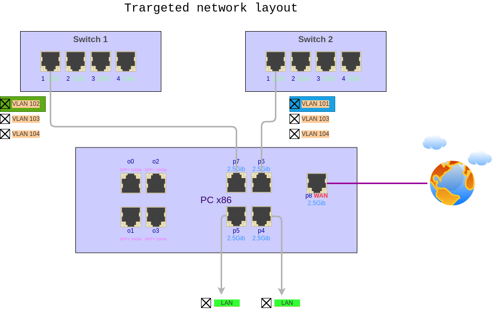
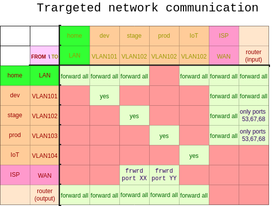
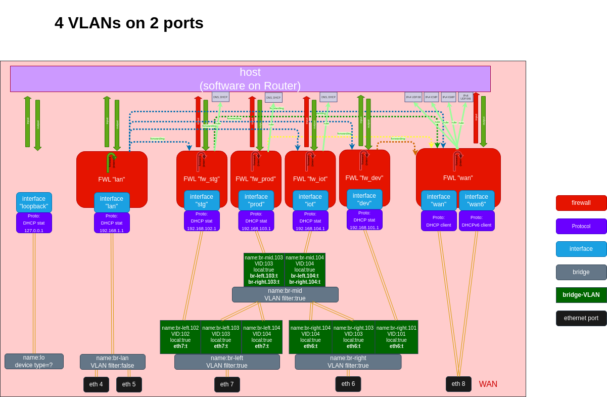

# x86 VLAN isolated with stub VLAN ID 99

TOC:
- [x86 VLAN isolated with stub VLAN ID 99](#x86-vlan-isolated-with-stub-vlan-id-99)
  - [The goals](#the-goals)
  - [OpenWRT router. configuration](#openwrt-router-configuration)
  - [OpenWRT router. Cllect network configuration](#openwrt-router-cllect-network-configuration)


## The goals

OpenWRT 23.05.3 is installed on PC x86 with 4 SFP ports (ports are enumerated: 0-3) and 5 ethernet ports (ports are enumerated: 4 - 8). This is "OpenWRT router".

- ISP is connected to ethernet port 8.
- 2 switches are connected to OpenWRT router via ethernet ports 6 and 7.
- Required routing:
  - to route segment "stg" (192.168.102.0/24) to one switch only
  - to route segment "dev" (192.168.101.0/24) to another switch only
  - to route segments "prod" (192.168.103.0/24) and "iot" (192.168.1.0/24) to all switches.




Below is detailed description of targeted configuration.

1. Interface "dev" (development) = VLAN 101 goes to port 6 only; DHCP: static, 192.168.101.1/24
2. Interface "stg" (stage) = VLAN 102 goes to port 7 only; DHCP: static, 192.168.102.1/24
3. Interface "prod" = VLAN 103 goes to both ports 6 & 7; DHCP: static, 192.168.103.1/24
4. Interface "IoT" = VLAN 104 goes to both ports 6 & 7; DHCP: static, 192.168.104.1/24
5. Interface "LAN" = (untagged) goes to both ports 4 & 5; DHCP: static, 192.168.1.1/24
6. VLANs are isolated
7. Zone "fw_dev" (firewall for "dev")
   1. covered networks/interfaces: "dev"
   2. INPUT (to all router services): allow
   3. OUTPUT (from router services to zone): allow
   4. FORWARD (between covered networks/interfaces): disable
   5. allow forward from zones: "lan"
   6. allow forward to zones: "wan", "wan6"
   7. extra trafic rules: non
8. Zone "fw_stg" (firewall for "stg")
   1. covered networks/interfaces: "stg"
   2. INPUT (to all router services): disable
   3. OUTPUT (from router services to zone): allow
   4. FORWARD (between covered networks/interfaces): disable
   5. allow forward from zones: "lan"
   6. allow forward to zones: "wan", "wan6"
   7. extra trafic rules:
      1. from zone "fw_stg" to router ports 53,67,68 by TCP UDP: allow
9. Zone "fw_prod" (firewall for "prod")
   1. covered networks/interfaces: "prod"
   2. INPUT (to all router services): disable
   3. OUTPUT (from router services to zone): allow
   4. FORWARD (between covered networks/interfaces): disable
   5. allow forward from zones: non
   6. allow forward to zones: "wan", "wan6"
   7. extra trafic rules:
      1. from zone "fw_prod" to router ports 53,67,68 by TCP UDP: allow
10. Zone "fw_iot" (firewall for "IoT")
   1. covered networks/interfaces: "iot"
   2. INPUT (to all router services): disable
   3. OUTPUT (from router services to zone): allow
   4. FORWARD (between covered networks/interfaces): disable
   5. allow forward from zones: non
   6. allow forward to zones: non
   7. extra trafic rules:
      1. from zone "fw_iot" to router ports 53,67,68 by TCP UDP: allow





## OpenWRT router. configuration




## OpenWRT router. Cllect network configuration

```bash
PROJDIR="/your/project/dir/on/laptop"


cd $PROJDIR
mkdir config_router1_openwrt && cd config_router1_openwrt

# Get OpenWRT configuration:
mkdir etc && cd etc
scp -r root@192.168.1.1:/etc/config . 
rm -r config/history

# Get kernel param at runtime:
scp -r root@192.168.1.1:/etc/sysctl.d .
scp root@192.168.1.1:/etc/sysctl.conf .


cd ${PROJDIR}/config_router1_openwrt


# Get hardware and OS info
echo "# ssh root@192.168.1.1 ubus call system board > ubus_call_system_board" > ubus_call_system_board
ssh root@192.168.1.1 ubus call system board >> ubus_call_system_board
# Get netowrk config, firewall, dhcp from ubus:
echo "# ssh root@192.168.1.1 ubus call uci get \'{\"config\": \"network\"}\'> ubus_call_uci_get_config_network" > ubus_call_uci_get_config_network
ssh root@192.168.1.1 ubus call uci get \'{\"config\": \"network\"}\' >> ubus_call_uci_get_config_network

echo "# ssh root@192.168.1.1 ubus call uci get \'{\"config\": \"dhcp\"}\'> ubus_call_uci_get_config_dhcp" > ubus_call_uci_get_config_dhcp
ssh root@192.168.1.1 ubus call uci get \'{\"config\": \"dhcp\"}\' >> ubus_call_uci_get_config_dhcp

echo "# ssh root@192.168.1.1 ubus call uci get \'{\"config\": \"firewall\"}\' > ubus_call_uci_get_config_firewall" > ubus_call_uci_get_config_firewall
ssh root@192.168.1.1 ubus call uci get \'{\"config\": \"firewall\"}\' >> ubus_call_uci_get_config_firewall

# Get netowrk config, firewall, dhcp from uci:
echo "# ssh root@192.168.1.1 uci show network > uci_show_network" > uci_show_network
ssh root@192.168.1.1 uci show network >> uci_show_network

echo "# ssh root@192.168.1.1 uci show dhcp > uci_show_dhcp" > uci_show_dhcp
ssh root@192.168.1.1 uci show dhcp >> uci_show_dhcp

echo "# ssh root@192.168.1.1 uci show firewall > uci_show_firewall" > uci_show_firewall
ssh root@192.168.1.1 uci show firewall >> uci_show_firewall

# Get network config from ip:
echo "# ssh root@192.168.1.1 ip -details -json link show \| jq > ip_details_json_link_show" > ip_details_json_link_show
ssh root@192.168.1.1 ip -details -json link show \| jq >> ip_details_json_link_show

# Get network config from brctl:
echo "# ssh root@192.168.1.1 brctl show > brctl_show" > brctl_show
ssh root@192.168.1.1 brctl show >> brctl_show
# showstp   	<bridge>		show bridge stp info:
echo "# ssh root@192.168.1.1 brctl showstp br-left > brctl_br-left_setup_show" > brctl_br-left_setup_show
ssh root@192.168.1.1 brctl showstp br-left >> brctl_br-left_setup_show

echo "# ssh root@192.168.1.1 brctl showstp br-right > brctl_br-right_setup_show" > brctl_br-right_setup_show
ssh root@192.168.1.1 brctl showstp br-right >> brctl_br-right_setup_show

echo "# ssh root@192.168.1.1 brctl showstp br-mid > brctl_br-mid_setup_show" > brctl_br-mid_setup_show
ssh root@192.168.1.1 brctl showstp br-mid >> brctl_br-mid_setup_show


# Get routing rules
echo "# ssh root@192.168.1.1 ip rout > ip_routing_table_show" > ip_routing_table_show
ssh root@192.168.1.1 ip rout >> ip_routing_table_show

# Get all network connections, routing tables, interface statistics
echo "root@192.168.1.1 ss -tupl -n > ss_port_listeners_show" > ss_port_listeners_show
ssh root@192.168.1.1 ss -tupl -n >> ss_port_listeners_show

```

